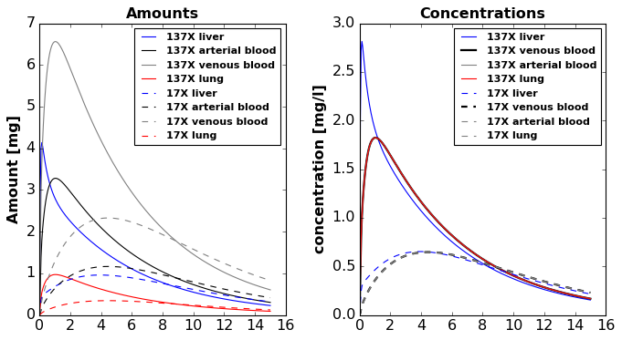

## Caffeine PKPD Model (König)

Run simulations for 300 steps from [0, 15] h. 
```
s = r.simulate(0, 15, 301)
```
The following species are plotted

```python
# Amounts
ax1.plot(s['time'], s['Ali_caf'], label='137X liver', color='blue')
ax1.plot(s['time'], s['Aar_caf'], label='137X arterial blood', color='black', linewidth=1.0)
ax1.plot(s['time'], s['Ave_caf'], label='137X venous blood', color='gray')
ax1.plot(s['time'], s['Alu_caf'], label='137X lung', color='red')

ax1.plot(s['time'], s['Ali_px'], label='17X liver', color='blue', linestyle="dashed")
ax1.plot(s['time'], s['Aar_px'], label='17X arterial blood', color='black', linestyle="dashed", linewidth=1.0)
ax1.plot(s['time'], s['Ave_px'], label='17X venous blood', color='gray', linestyle="dashed")
ax1.plot(s['time'], s['Alu_px'], label='17X lung', color='red', linestyle="dashed")
ax1.set_title('Amounts')
ax1.set_ylabel('Amount [mg]')
# ax1.set_xlabel('time [h]')
ax1.legend(prop=legend_properties)

# Concentrations
ax2.plot(s['time'], s['Cli_caf'], label='137X liver', color='blue')
ax2.plot(s['time'], s['Cve_caf'], label='137X venous blood', color='black', linewidth=2.0)
ax2.plot(s['time'], s['Car_caf'], label='137X arterial blood', color='gray')
ax2.plot(s['time'], s['Clu_caf'], label='137X lung', color='red')

ax2.plot(s['time'], s['Cli_px'], label='17X liver', color='blue', linestyle='dashed')
ax2.plot(s['time'], s['Cve_px'], label='17X venous blood', color='black', linewidth=2.0, linestyle='dashed')
ax2.plot(s['time'], s['Car_px'], label='17X arterial blood', color='gray', linestyle='dashed')
ax2.plot(s['time'], s['Clu_px'], label='17X lung', color='gray', linestyle='dashed')
ax2.set_title('Concentrations')
ax2.set_ylabel('concentration [mg/l]')
# ax2.set_xlabel('time [h]')
ax2.legend(prop=legend_properties)
```

The result should be similar to the the following figure:


